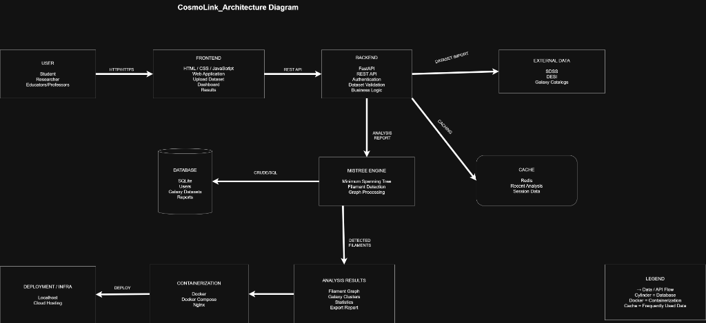
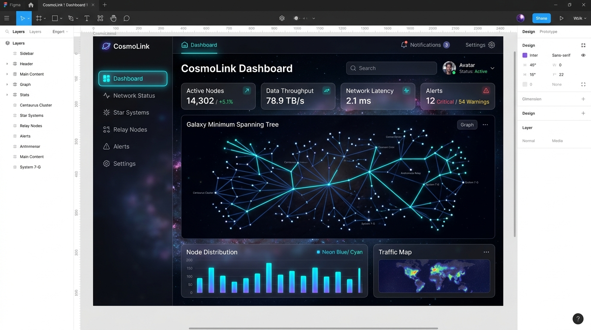
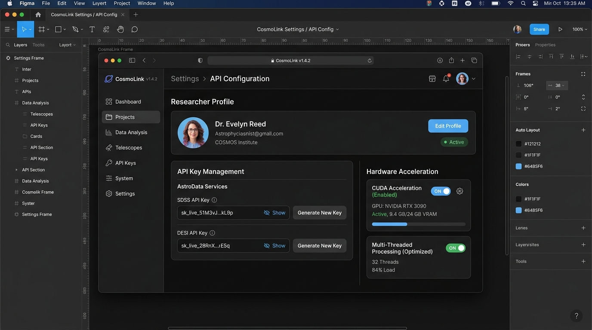

# CosmoLink

CosmoLink is a web application that helps astronomers visualize galaxy distributions and discover cosmic filament structures using the Minimum Spanning Tree (MST) algorithm.

## 📋 Vision Document

### Project Overview
**CosmoLink** is an astronomy and cosmology web visualization platform designed to help astrophysicists, researchers, and space enthusiasts analyze spatial distributions in large-scale cosmological datasets. Utilizing Minimum Spanning Trees (MST) based on the **MiSTree** algorithm, CosmoLink connects galaxy coordinates in 2D/3D space to identify, quantify, and map cosmic filament structures across the universe.

### Problem Statement
Cosmological datasets contain billions of galaxy data points. Identifying continuous cosmic filaments and galaxy clusters manually or through non-graph-based algorithms is computationally expensive, prone to noise, and visually unintuitive. Astronomers require a fast, containerized web interface to compute MST graphs and extract structural parameters on demand.

### Target Users (Personas)
1. **Dr. Elena Vance (Cosmology Researcher)**: Needs quick MST extraction over galaxy survey data (e.g., SDSS, DESI) to validate cosmic web models.
2. **Marcus Chen (Astrophysics Graduate Student)**: Requires an accessible, containerized web tool to experiment with MST parameters and visualize filament length distributions.

### Vision Statement
"To provide astrophysicists and science enthusiasts worldwide with an accessible, high-performance, containerized interactive web platform for mapping cosmic filaments and uncovering the hidden structural skeleton of our universe."

### Key Features & Goals
- 🌌 **Galaxy Field Generation**: Random or dataset-driven 2D spatial coordinate mapping.
- ⚡ **Real-Time MST Computation**: Live Prim's/Kruskal's MST calculation for galaxy node connections.
- 📊 **Filament Metrics**: Real-time extraction of total branch length, node density, and edge count.
- 🐳 **Containerized Local Dev**: Instant 1-command local environment via Docker and Nginx.

### Success Metrics
- Sub-100ms MST rendering for up to 500 galaxy nodes in browser.
- 100% reproducible local development setup using Docker Compose across macOS, Windows, and Linux.

---

## 🛠️ Local Development Tools

To run and manage this project locally, ensure you have the following tools installed:

| Tool | Recommended Version | Purpose |
| :--- | :--- | :--- |
| **Docker Desktop** | `v20.10+` | Container runtime engine and image manager. |
| **Docker Compose** | `v2.0+` | Multi-container Docker application orchestration. |
| **Nginx (Alpine)** | `nginx:alpine` | Ultra-lightweight web server image used inside container. |
| **Git** | `v2.30+` | Distributed version control system. |
| **Web Browser / cURL** | Any modern browser | Verification of running local web server. |

---

## 🚀 Quick Start – Local Development

Follow these steps to build and launch the application locally using Docker Compose:

### 1. Clone the Repository
```bash
git clone https://github.com/<your-username>/CosmoLink.git
cd CosmoLink
```

### 2. Launch with Docker Compose
Run the following command in the project root to build the Docker image and start the server:
```bash
docker-compose up --build -d
```

### 3. Access the Application
Open your web browser and navigate to:
```text
http://localhost:8080
```

### 4. Live Hot-Reloading
The `docker-compose.yml` mounts the `./app` directory into the container's Nginx web root (`/usr/share/nginx/html`). Any edits saved in `app/index.html` will immediately update on browser refresh without rebuilding the container.

### 5. Stop the Server
To stop the running container and remove its network:
```bash
docker-compose down
```

---

## 🌿 Branching Strategy (GitHub Flow)

We strictly follow the **GitHub Flow** branching strategy for project development.

```text
       main (production-ready)
--------●-------------------●------------●--->
         \                 /            /
          \-- feature/docker-setup ----/
```

### Key Workflow Rules:
1. **`main` Branch**:
   - Represents stable, production-ready code.
   - Direct commits to `main` are restricted.
2. **Feature Branches (`feature/<feature-name>`)**:
   - All new features, bug fixes, and infrastructure tasks must be developed on separate branches created off `main`.
   - *Example*: `feature/docker-setup`, `feature/mst-algorithm`, `bugfix/canvas-resize`.
3. **Pull Requests (PR)**:
   - When a feature is complete, open a Pull Request targeting `main`.
   - Requires at least 1 peer review approval before merging.
4. **Merge Strategy**:
   - Merge using **Squash and Merge** or standard Merge commit, then delete the feature branch.
   -
   - ## 🏗️ System Architecture



### Key Architecture Components:
- **Frontend**: HTML / CSS / JavaScript Web Application featuring dataset upload, interactive dashboards, and result visualization.
- **Backend**: FastAPI REST API handling user authentication, dataset validation, business logic, and dataset imports.
- **Mistree Engine**: Core processing module executing Minimum Spanning Tree algorithms, filament detection, and graph calculations.
- **Database & Cache**: SQLite database for persistent storage (Users, Datasets, Reports) and Redis cache for session data and fast retrieval of recent analysis.
- **External Integration**: Support for astronomical data sources such as SDSS and DESI.
- **Infrastructure**: Containerized with Docker & Nginx for smooth deployment on local or cloud hosting environments.

## 💻 Frontend Application Screens

The web application (`/app`) features 6 modern, dark cosmic-themed interactive screens with glassmorphism design and live canvas MST graph simulations:

1. **📊 Dashboard (`app/index.html`)**: Overview of active datasets, completed analyses, detected filaments, and interactive galaxy MST canvas simulation.
2. **📁 Upload Dataset (`app/upload.html`)**: Drag & drop CSV/FITS dataset loader, column schema mapper, and external archive importers (SDSS, DESI, Gaia).
3. **⚡ MST Engine (`app/analysis.html`)**: Algorithm parameter sliders ($d_{\text{cut}}$, smoothing factor, distance metrics) and pipeline progress timeline.
4. **🔭 Graph Visualizer (`app/results.html`)**: High-res interactive canvas visualization of minimum spanning tree galaxy filaments with zoom/pan and redshift filters.
5. **📜 History & Reports (`app/history.html`)**: Log of past analysis runs with PDF report export, CSV filament downloads, and JSON graph exports.
6. **⚙️ Settings (`app/settings.html`)**: Researcher profile management, SDSS/DESI API key configuration, and hardware acceleration options.

## 🎨 Figma Design Frames (6 Screens)

The repository includes high-fidelity UI design frames for all 6 core screens inside the [`figma/`](./figma/) folder:

| Screen | Figma Frame Mockup Preview |
| :--- | :--- |
| **1. Dashboard Screen** |  |
| **2. Upload Dataset Screen** |  |
| **3. MST Engine Screen** |  |
| **4. Graph Visualizer Screen** |  |
| **5. History & Reports Screen** |  |
| **6. Settings & API Screen** |  |


## Necessary screenshots:

Repository Structure


GitHub Branches and flow


